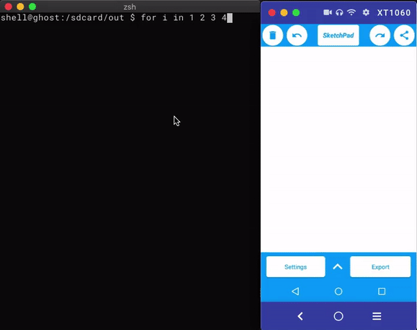

# Android Event Playback

This repository contains scripts that convert event logs from
Android's `getevent` utility into binary files that can be played
back via the `adb` shell.



## Running the Scripts

1. Collect events from the device or emulator `adb shell getevent -t > events.log`
    - Note that the `-t` flag is required. It provides the script a way to calculate delays between events. 
2. Run the conversion script: `./runWithInput events.log`
3. Push the event files and coordinator script to the device: `adb push out/* sdcard/android-event-playback/`
4. Run the playback script: 
    ```
    adb shell "sh -c 'cd /sdcard/android-event-playback/ && sh ./run_events.sh'"
    ```

- Repeat Step 4 to replay the events again and again.
- Repeat Step 1-4 for any new event log or changes to the event log that you'd like to playback.

- **Note**: Each device or emulator configuation may have vastly different event log outputs for 
  similar events. Replaying event logs on a different device or emulator configuration is not 
  expected to work. Event playback should work on identical device or emulator configuations.

## Why this project exists:

This project is an experiment to better understand how the `getevent` and
`sendevent` utilities work in Android. 

After experimentation, `sendevent` it became clear that even after successfully
exporting events via `getevent`, a couple issue became clear. First, it took 
reformatting the output of `getevent` to be able to play events back with `sendevent`.
Second, `sendevent` seemed to lag when a large number of event like dragging occurred.

If you've encountered the second issue you'll note that the workaround suggested on sites
like StackOverflow are to write to `/dev/input/eventX` directly. But this means that we've
got to format the output of `getevent` into binary! 

If you've gone as far as converting the events into binary, you've likely been rewarded
with another issue: Events are played back too fast, causing events to be dropped or skipped 
all-together!

To get around this we need some sort of coordinator to delay the input of events into `/dev/input/eventX`.
This project attempts to generate a coordinator script (`run_events.sh`) so that events
are played back in a similar time span as the original events, but also tried to input events
directly into `/dev/input/eventX` to avoid some of the slowness typically experienced.

May this experiment be helpful in your journey to automate the Android UI!

## Requirements

- `awk`: [Specifically GAwk 4.x](https://www.gnu.org/software/gawk/)
- `xxd`: [Hexdump Utility](https://linux.die.net/man/1/xxd)
- `adb`: [Part of the Android SDK Platform Tools](https://developer.android.com/studio/command-line/adb)
